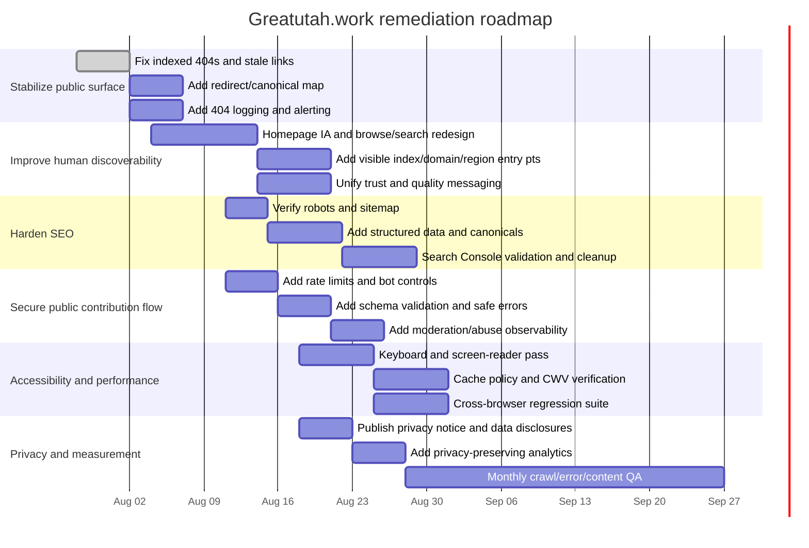

# Greatutah.work Deep Research Audit and Improvement Report

## Executive summary

greatutah.work is not a conventional content site first and an API second; it is effectively an LLM-oriented knowledge system with a thin public website on top. The strongest part of the product is its machine-readable architecture: the public manual at `/llms.txt` documents stable markdown endpoints, typed views, a public locations API, and a contribution API, while also stating that the site is built around raw markdown, lower-case stable paths, no auth, no rate limits, and no JavaScript on the raw interface. The homepage and indexed entry pages reinforce the AI-assistant workflow by telling users to copy a prompt into ChatGPT, Claude, Gemini, or Perplexity. citeturn1view0turn4view0turn2view2

That architecture is powerful for agents, but it creates a product gap for humans. The homepage, as publicly fetched in this audit, exposes almost no obvious browse/search/navigation affordances beyond the AI-assistant prompt and `/llms.txt`; meanwhile, the site itself describes roughly 600 pages of content across ventures, people, resources, guides, and historical “work” pages. WCAG requires multiple ways to locate pages within a set of pages, and the current public entry experience does not clearly surface them to first-time human visitors. citeturn1view0turn4view0turn19search1turn19search5

The highest-priority defects are not visual polish items. They are structural: an indexed public page at `/raise-hand` returns a 404; the public contribution flow is documented on a site that also says it has no auth and no rate limits; URL architecture is fragmented across `www`, apex, `/entry/...`, `/p/...`, and raw `/pages/*.md`; and the content representation appears inconsistent across consumers, since search snippets surface specific article text while direct page fetches can fall back to generic boilerplate. Those issues directly affect trust, crawl efficiency, abuse resistance, support burden, and discoverability. citeturn6search6turn7view0turn1view3turn6search3turn7view1turn4view0

My overall judgment is that greatutah.work already has an unusually strong **data model and machine interface**, but its **human-facing information architecture, SEO hygiene, and operational hardening** lag behind the sophistication of the underlying content system. The site can become substantially better with a relatively focused remediation program: fix the broken/stale surfaces, expose explicit human browse/search paths, tighten canonicalization, add standard SEO and privacy infrastructure, and harden the contribution endpoint. citeturn4view0turn16search1turn16search2turn17search0turn17search2

## How the site works today

The site’s own manual makes the usage model unusually explicit. For agents or power users, the intended flow is: read `/llms.txt`, then fetch `/views/index.md`, explore typed views such as `/views/ventures.md`, `/views/resources.md`, `/views/helpers.md`, `/views/work.md`, or `/views/needs.md`, and then open individual markdown pages under `/pages/{slug}.md`. There is also a public geospatial endpoint at `/api/locations`, a public GeoJSON export, and a documented contribution API at `/api/contribute`. The manual also documents a browser-based draft flow at `/contribute#{base64url-of-json}`. citeturn4view0turn2view2

For human users, the public homepage and indexed entry pages currently center an “ask your AI assistant” motion rather than an on-site browse motion. The live page text that was fetchable in this audit says “Ask better questions about Utah,” tells users to copy a prompt into an external assistant, and points AI agents to `/llms.txt`. Search snippets additionally suggest that some pages contain human-oriented copy such as “Humans: browse above. Agents: fetch /llms.txt,” but that browse layer is not robustly visible from the fetchable page representation examined here. citeturn1view0turn14search1turn6search3

A practical “how to use it” path for a technically literate user today is therefore closer to an API/manual workflow than a normal website workflow:

```bash
# Read the public manual
curl https://greatutah.work/llms.txt

# Discover content types and derived views
curl https://greatutah.work/views/index.md

# Browse a vertical
curl https://greatutah.work/views/ventures.md
curl https://greatutah.work/views/resources.md
curl https://greatutah.work/views/needs.md

# Open a page directly
curl https://greatutah.work/pages/fervo-energy.md

# Query nearby locations
curl 'https://greatutah.work/api/locations?near=Ogden&radius_miles=35&type=resource'
```

Those exact flows are documented by the site itself. That is a real strength. The problem is that they are primarily discoverable through `/llms.txt`, which is excellent for agents and poor as the main mental model for most new human visitors. citeturn4view0turn2view2

## Prioritized issues

The table below focuses on confirmed or strongly evidenced issues first, then probable gaps that should be treated as remediation targets unless verified otherwise in a full browser/network audit.

| Issue | Category | Severity | Evidence and reproduction | Suggested fix | Effort | Impact |
|---|---|---:|---|---|---:|---:|
| Indexed `/raise-hand` page returns 404 | Functionality, SEO | **High** | A search result for `https://www.greatutah.work/raise-hand` is publicly indexed, but opening it returns `404 Not Found`. Reproduce by searching the site or opening the indexed result. citeturn6search6turn7view0 | Restore the route, or 301 it to the correct destination, remove stale internal links, and request reindexing | Small | High |
| Human entry flow is unclear and under-navigated | Usability, IA | **High** | The homepage fetch presents only the AI-assistant prompt and `/llms.txt`; the site’s own manual says there are ~600 pages and multiple views, but those are not visibly surfaced in the primary human-facing page representation audited here. This conflicts with WCAG’s “multiple ways” principle. citeturn1view0turn4view0turn19search1turn19search5 | Add visible browse/search/index navigation for humans on the homepage and page template | Medium | High |
| Public contribution surface appears unauthenticated and unthrottled | Security, operations | **Critical** | The manual says “No auth, no rate limits,” documents `POST /api/contribute`, and says the `/contribute` page lets a user preview and submit without agent permission. That creates obvious spam/abuse risk unless rate limits, bot controls, moderation queues, and origin protections exist behind the scenes. citeturn4view0turn2view2 | Add IP/user-agent rate limiting, bot protection, CSRF protection where relevant, spam scoring, and server-side validation | Medium | Very High |
| URL architecture is fragmented | SEO, deployment | **High** | Public evidence shows `www` and apex variants, `/entry/...` URLs that redirect to `/p/...`, and a separate raw markdown `/pages/*.md` model. The site documents apex as canonical, but mixed discovery patterns remain visible in search. citeturn1view0turn1view3turn4view0turn6search3turn11search3 | Enforce one canonical HTML URL pattern, keep raw markdown as alternate technical endpoints, and strengthen canonical tags/internal linking | Medium | High |
| Page representation differs across consumers | SEO, compatibility, accessibility | **High** | Search snippets for content pages surface detailed article content, but direct page fetch in this audit often resolved to generic “Ask better questions about Utah” boilerplate. That kind of representational mismatch can confuse crawlers, assistive tools, social scrapers, and support/debug workflows. citeturn6search3turn7view1turn11search3 | Ensure the same primary document meaning is available in the initial HTML and not hidden behind alternate rendering paths | Medium | High |
| Privacy notice is not prominent from key public entry points | Privacy, trust | **High** | The homepage and the public manual emphasize data contribution and external-AI usage, but the publicly surfaced entry points examined in this audit do not surface a privacy policy or clear data-handling notice. citeturn1view0turn4view0 | Add a privacy policy link in footer/header and on contribution surfaces; disclose submitted data handling and third-party handoff risk | Small | High |
| Traditional SEO infrastructure is not publicly verifiable from the audited surface | SEO | **Medium** | The site strongly advertises `llms.txt`, but Google still relies on standard root-level robots and sitemap infrastructure. I could not verify those files from the audited surface, so they should be made explicit and easy to discover. citeturn4view0turn16search0turn16search1turn16search12 | Publish/verify `robots.txt`, `sitemap.xml`, and sitemap references from `robots.txt` | Small | High |
| Structured data is not evident in search appearance | SEO | **Medium** | Public search results show ordinary snippets rather than enriched structured-data signals. Google explicitly uses structured data to understand pages and enable richer search treatments. citeturn6search3turn16search2turn16search6 | Add JSON-LD for `WebSite`, `Organization`, `CollectionPage`, `BreadcrumbList`, and `Article`/`ProfilePage` as appropriate | Medium | Medium |
| Trust messaging is honest but inconsistent | Content, conversion | **Medium** | Public descriptions vary between “travel guide,” “wiki,” “written mostly by AI,” “reviewed by humans,” and “entries may contain hallucinations.” The manual adds `Confidence` grades, but that quality model is not obvious from the homepage representation. citeturn6search0turn6search6turn4view0 | Unify positioning, expose trust signals consistently, and explain confidence levels on the public page template | Medium | Medium |
| Primary CTA depends on copy/paste into third-party AI tools | Usability, accessibility, privacy | **Medium** | The homepage’s visible CTA is to copy a prompt into external assistants. That adds friction, pushes users off-site, and burdens users who prefer direct browse/search. It also complicates privacy expectations because user queries are then sent to third parties. citeturn1view0turn4view0turn19search0turn19search1 | Add native search and browse first; keep AI handoff as a secondary CTA | Medium | High |
| Server-side input-validation expectations should be hardened and documented | Security | **Medium** | The contribution endpoint accepts public JSON payloads and returns validation errors. OWASP recommends strict allowlist validation, bounded lengths, and rejection of unexpected input. citeturn4view0turn17search2turn17search5 | Enforce schema validation, size limits, rate limits, anti-spam fields, and safe error messages | Small | High |
| Analytics and observability are not evident | Analytics, deployment | **Medium** | The fetched public surfaces do not expose obvious analytics/telemetry or operational reporting hooks. That is privacy-positive, but it also suggests weak visibility into broken paths, search usage, and crawl anomalies unless implemented elsewhere. citeturn1view0turn4view0 | Add privacy-preserving analytics and error monitoring; track 404s, redirects, top searches, and contribution funnel completion | Small | Medium |
| Explicit cache policy and static-asset policy should be verified | Performance, deployment | **Low** | The architecture likely performs well because the raw interface is markdown-centric and low-complexity, but production caching still needs explicit headers for repeat visits and immutable assets. citeturn4view0turn18search1turn18search9 | Set `Cache-Control` intentionally for HTML, feeds, and immutable assets; validate with repeat-load testing | Small | Medium |

## Detailed category analysis

The category scorecard below summarizes where the site is strong, where it is weak, and where the current audit surface limited verification.

| Category | Current assessment | What is working | Main problems |
|---|---|---|---|
| Functionality | Mixed | Public content is discoverable and there is a coherent raw-content/API model documented in detail. citeturn4view0turn2view2 | Broken public route (`/raise-hand`), unclear human flow, possible representation mismatch across clients. citeturn6search6turn7view0turn7view1 |
| Usability | Weak for humans, strong for agents | Agent workflow is unusually clear and well-documented. citeturn4view0 | Human navigation, browse/search, and conversion paths are too hidden or too dependent on external AI tools. citeturn1view0turn19search1 |
| Content | Mixed | Strong editorial ambition, explicit confidence model, useful typed views. citeturn4view0 | Brand/positioning language is inconsistent; trust model is not surfaced prominently enough for first-time users. citeturn6search0turn6search6turn4view0 |
| Performance | Probably good baseline, insufficiently verified | Low-complexity raw markdown architecture is a strong foundation. citeturn4view0 | Need explicit validation of caching, HTML-source content discoverability, and Core Web Vitals behavior. citeturn18search1turn18search7turn18search17 |
| SEO | Weak-to-mixed | Search engines are indexing content pages already. citeturn6search3turn11search3 | Broken indexed URL, fragmented URL formats, unclear robots/sitemap verification, no obvious structured-data advantage. citeturn7view0turn1view3turn16search1turn16search2 |
| Security | Mixed with one critical operational risk | HTTPS and host canonicalization are at least partially in place; `www` redirects to apex in fetched views. citeturn1view0turn4view0 | Public contribution endpoint combined with “no auth, no rate limits” language is the standout risk; CSP/header posture could not be verified from the audited surface. citeturn4view0turn17search0turn12search1 |
| Accessibility | Mixed and needs direct DOM testing | Text-first markdown and low-JS philosophy can be strong for accessibility when surfaced properly. citeturn4view0turn16search11 | Homepage does not clearly provide multiple human navigation methods; copy/paste-to-AI is not an inclusive primary flow. citeturn1view0turn19search1turn19search19 |
| Privacy | Weak | No obvious invasive public tracking was visible in fetched surfaces. citeturn1view0turn4view0 | Data handling for contributions and third-party AI handoff are not clearly disclosed on key public entry points. citeturn1view0turn4view0 |
| Cross-browser and compatibility | Mixed | Raw markdown endpoints are inherently portable and easy for tools to consume. citeturn4view0 | Client-dependent representations suggest inconsistent results across browsers, crawlers, or fetchers. citeturn6search3turn7view1 |
| Deployment/configuration | Mixed | Canonical host intent is documented, and redirects are visible. citeturn4view0turn1view3 | Needs stronger canonical hygiene, monitoring, and explicit standard root files. citeturn16search0turn16search1 |

On **functionality and forms**, the most important observation is that the product actually has two interfaces: a human-visible browser layer and an agent-targeted raw interface. The raw interface is coherent and appears thoughtfully designed. The browser layer, by contrast, is too thin for the breadth of the underlying knowledge base. In a normal user journey, a visitor should be able to understand what the site is, browse by topic, search natively, and contribute without first learning an agent protocol. The existence of an indexed 404 page suggests that route hygiene and content lifecycle management are not yet keeping pace with the information model. citeturn4view0turn6search6turn7view0

On **usability and UX patterns**, the core product decision to funnel users toward external AI tools may be strategically intentional, but it should not be the primary interaction pattern for a public knowledge site. It increases friction, forces context switching, and creates an immediate trust/privacy question about where a user’s query will go. WCAG’s “multiple ways” requirement is relevant here: a site with hundreds of pages should visibly provide at least two clear findability paths, such as browse by type and on-site search, or browse by geography and browse by domain. The manual clearly documents those views, but the homepage representation audited here does not. citeturn1view0turn4view0turn19search1turn19search5

On **content quality and messaging**, the site is conceptually interesting but narratively over-compressed. Public descriptions variously frame it as a travel guide, a wiki, an LLM-maintained corpus, and a place where entries may contain hallucinations. That level of candidness is refreshing, but it needs tighter hierarchy. A visitor should immediately understand: what the site is, why it is useful, how trustworthy it is, how claims are graded, and what to do next. Today, the quality-control model appears in the agent manual, not in the main public consumption path. citeturn6search0turn6search6turn4view0

On **performance**, the site has a major architectural advantage: a markdown-first, low-JS model can be exceptionally fast and resilient. However, fast architecture alone is not enough. web.dev’s guidance emphasizes making the primary content discoverable in the HTML source, keeping LCP resources prioritized, and setting deliberate cache policies. Because some fetch contexts in this audit saw only generic boilerplate while search snippets saw detailed page content, I would treat HTML-source discoverability as a performance and rendering concern, not just an SEO concern. citeturn4view0turn18search0turn18search1turn18search7turn18search17

On **SEO**, `llms.txt` is an excellent addition but it is not a replacement for standard search-engine hygiene. Google’s documentation is explicit that robots rules belong in root-level `robots.txt`, that sitemaps should be published and referenced, and that structured data helps search engines understand page types and can improve rich search appearance. This site especially needs clean standard SEO because it uses multiple public URL shapes and because its content library is large enough that crawl efficiency matters. The broken indexed `/raise-hand` page is a direct signal that crawl/index lifecycle controls need tightening. citeturn7view0turn16search0turn16search1turn16search2turn16search5turn16search12

On **security**, the key risk is operational abuse rather than classic vulnerability evidence. A public contribution endpoint on a site that advertises “no auth, no rate limits” is an invitation to spam, queue flooding, and possibly resource exhaustion if those protections are truly absent at the edge or application layer. MDN and OWASP guidance supports a baseline of CSP, strict origin/resource control, and allowlist-style validation for public input surfaces. Even if the back-end moderation model is safe, the edge should still enforce rate limits and anti-automation controls. citeturn4view0turn17search0turn17search2turn17search3turn12search1

On **accessibility**, the text-first model is promising, but the current human flow is not inclusive enough. W3C’s guidance stresses clear headings/labels, meaningful link purpose, bypassable repeated content, and multiple ways to locate pages. A homepage whose main action is “copy this into your AI assistant” is not a strong primary experience for keyboard users, users with cognitive load constraints, or users who simply expect native browse/search behavior. Separate from that, a full WCAG 2.1 AA check will still need direct DOM testing for heading order, form labels, focus visibility, skip links, landmark structure, contrast, and keyboard traps. citeturn1view0turn19search0turn19search1turn19search2turn19search18turn19search19

On **analytics, privacy, and deployment**, the revealed public pages do not show obvious heavy tracking, which is good, but they also do not clearly tell users what data is collected when they contribute content or when they are sent off to third-party AI tools. From an operations standpoint, you also want privacy-preserving measurement—at minimum to track 404s, redirect patterns, top entry pages, top failed searches, and contribution funnel dropout. Without that telemetry, IA and SEO fixes will be harder to prioritize empirically. citeturn1view0turn4view0

## Remediation roadmap

The most effective program is a phased, hygiene-first one: fix broken/stale public surfaces immediately, then improve human discoverability, then harden standard SEO/security/privacy infrastructure, and only then spend time on nuanced polish. That ordering follows both the observed site risks and published guidance on crawlability, accessibility, and security headers. citeturn7view0turn16search1turn17search0turn19search1



The following implementation patterns will remove a large share of the current risk surface.

**Canonical host redirects and route hygiene.** The site already documents apex canonicalization and publicly shows at least some redirects. Make that explicit and complete for every legacy route family. citeturn4view0turn1view3

```nginx
# Canonical host
server {
    listen 443 ssl http2;
    server_name www.greatutah.work;
    return 301 https://greatutah.work$request_uri;
}

# Legacy route family -> canonical HTML route
location ~ ^/entry/ventures/(.+)$ {
    return 301 https://greatutah.work/p/$1;
}

# Optional: custom 410 for intentionally removed pages
location = /raise-hand {
    return 301 https://greatutah.work/contribute;
}
```

**Root crawl files.** Google’s documentation recommends a root `robots.txt` and a discoverable sitemap reference. If the site has them already, surface and validate them; if not, add them now. citeturn16search0turn16search1turn16search12

```txt
# /robots.txt
User-agent: *
Allow: /

# If raw markdown and HTML twins exist, consider crawl guidance deliberately.
# Do not block important canonical HTML pages.

Sitemap: https://greatutah.work/sitemap.xml
```

**Security headers and public endpoint throttling.** MDN recommends CSP and related headers; OWASP recommends strict server-side validation for public inputs. Treat `/api/contribute` as an abuse-prone public API even if the queue is moderated. citeturn17search0turn17search2turn17search3

```nginx
# Security headers
add_header Content-Security-Policy "default-src 'self'; img-src 'self' data: https:; style-src 'self' 'unsafe-inline'; frame-ancestors 'none'; base-uri 'self'; form-action 'self'" always;
add_header Referrer-Policy "strict-origin-when-cross-origin" always;
add_header X-Content-Type-Options "nosniff" always;
add_header X-Frame-Options "DENY" always;
add_header Permissions-Policy "camera=(), microphone=(), geolocation=()" always;
add_header Strict-Transport-Security "max-age=31536000; includeSubDomains; preload" always;

# Rate limit public writes
limit_req_zone $binary_remote_addr zone=contrib:10m rate=5r/m;

location = /api/contribute {
    limit_req zone=contrib burst=10 nodelay;
    client_max_body_size 64k;
    proxy_pass http://app_backend;
}
```

**Structured data.** Google explicitly uses structured data to understand content. Because greatutah.work has strong content typing already, it is unusually well-positioned to add high-quality JSON-LD. citeturn16search2turn16search6turn16search14

```html
<script type="application/ld+json">
{
  "@context": "https://schema.org",
  "@type": "CollectionPage",
  "name": "Great Work — Utah",
  "url": "https://greatutah.work/",
  "description": "A public knowledge base of high-impact work, ventures, people, resources, and history in Utah.",
  "isPartOf": {
    "@type": "WebSite",
    "name": "greatutah.work",
    "url": "https://greatutah.work/"
  },
  "publisher": {
    "@type": "Organization",
    "name": "greatutah.work"
  }
}
</script>
```

A high-leverage **homepage redesign** should do four things at once: keep the AI-friendly proposition, expose native human browse paths, explain the trust model, and preserve the raw-interface power-user path. A simple first-pass homepage could have four primary cards: “Browse Ventures,” “Browse Resources,” “Browse by Region,” and “Use with AI,” plus one visible site search box. That one change would improve usability, accessibility, and SEO simultaneously because it would expose multiple ways to find content, make titles/headings more meaningful, and create a clearer internal-link graph for crawlers. citeturn1view0turn4view0turn19search1turn19search19

## Tools and references

This audit used a combination of manual public-page inspection and standards/official-reference review. The site-specific evidence came from the public homepage, public page results in search, redirect behavior seen on indexed routes, the public `llms.txt` manual, and the indexed 404 on `/raise-hand`. Official guidance was taken from Google Search Central for crawlability, sitemaps, and structured data; from W3C/WAI for WCAG findability and labeling/accessibility principles; from MDN and Mozilla Observatory documentation for security header expectations; and from OWASP for input-validation practices and public-endpoint hardening. citeturn1view0turn4view0turn6search3turn7view0turn16search0turn16search1turn16search2turn19search1turn19search2turn17search0turn17search2turn12search1

The main tools and public references used were these:

| Type | Source | Purpose |
|---|---|---|
| Manual site inspection | greatutah.work homepage and indexed pages | Verify visible user flows, redirects, and broken pages. citeturn1view0turn1view3turn7view0 |
| Site self-documentation | `llms.txt` | Understand architecture, intended usage, paths, APIs, and contribution flow. citeturn4view0turn2view2 |
| Search engine results | Public indexing of site pages | Confirm discoverability, snippets, duplicated route families, and the stale `/raise-hand` result. citeturn6search0turn6search3turn6search6turn11search3 |
| Google Search Central | Robots, sitemap, structured data docs | Benchmark crawlability and search hygiene. citeturn16search0turn16search1turn16search2turn16search5 |
| W3C / WAI | WCAG guidance | Benchmark navigation, labeling, and multiple-ways requirements. citeturn19search0turn19search1turn19search2turn19search18turn19search19 |
| MDN / Mozilla | CSP and Observatory docs | Benchmark security headers and baseline web security expectations. citeturn17search0turn17search3turn12search1 |
| OWASP | Input validation / REST security guidance | Benchmark public API validation and safe handling of user input. citeturn17search2turn17search5 |
| web.dev | Core Web Vitals and caching guidance | Benchmark performance and caching recommendations. citeturn18search0turn18search1turn18search7turn18search17 |

The highest-return next changes are clear: repair the broken indexed page, expose human browse/search paths on the homepage, harden the public contribution endpoint, normalize canonical URLs, and add standard privacy/SEO infrastructure. Once those are in place, greatutah.work’s unusually strong underlying content architecture will be much more understandable, trustworthy, and resilient for both people and machines. citeturn7view0turn4view0turn16search1turn17search2turn19search1